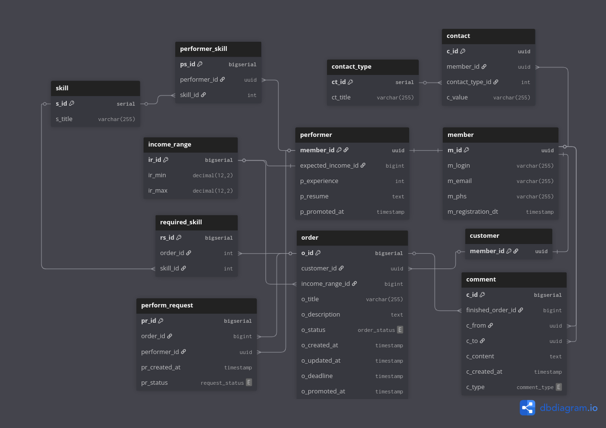

# БВ для інформаційної системи фриланс-біржі
Існують замовники — ті, хто створює замовлення з різними завданнями, встановлює терміни виконання та необхідні навички. Саме вони формують замовлення та розглядають запити від виконавців. Також вони можуть переглядати списки виконавців, використовуючи фільтри.

Існують виконавці. Вони переглядають замовлення, надсилають запити на виконання, редагують своє портфоліо, навички, якими володіють, а також свої контактні дані.

Система орієнтована на організацію процесів фриланс-біржі: створення замовлень, надання інформації про користувачів — замовників та виконавців, а також комунікацію між ними.

## Бізнес-вимоги
Система повинна зберігати та надавати інформацію про:
### Які існують користувачі
У кожного користувача є:
- логін
- пароль
- контактні дані
- дата реєстрації
- роль (замовник чи виконавець)
### Які існують замовники
У кожного замовника є:
- замовлення
- історія співпраці з виконавцями  l
### Які існують виконавці
У кожного виконавця є:
- резюме (по суті просто текст)
- навички, якими він володіє
- досвід роботи
- очікуваний діапазон доходу за годину роботи
- відгуки про нього від замовників у рамках виконаних завдань. Відгук може бути:
 - негативним
 - позитивним
 - нейтральним
- рейтинг, який формується на основі оцінок замовників
### Які існують завдання
У кожного завдання є:
- замовник
- заголовок
- опис
- вимоги до навичок
- діапазон оплати
- дата публікації
- дата оновлення
- крайній термін
- статус (відкрите, у процесі, виконане, скасоване)
### Які існують навички
Навички можуть бути як вимогами завдань, так і тими, якими володіють виконавці.

## Сутності
### Користувач
Я, як користувач, повинен мати можливість:
- редагувати та перевіряти інформацію про себе. Зокрема: контактні дані, пароль, тему застосунку тощо
- обирати на старті, ким я є: замовником чи виконавцем
### Замовник
Як замовник, я повинен мати можливість:
- переглядати інформацію про те, які існують виконавці
- створювати та редагувати завдання, на які виконавці зможуть надсилати запити
- шукати виконавців за навичками та досвідом
- відзначати, що конкретний виконавець виконує конкретне завдання (обидві сторони повинні підтвердити це)
- давати оцінки користувачам, а також залишати коментарі під їхнім профілем
- переглядати історію виконаних завдань
- час від часу піднімати свої завдання у пошуку
### Виконавець
Як виконавець, я повинен мати можливість:
- редагувати інформацію про себе як виконавця, а саме:
 - навички
 - резюме
 - досвід роботи
 - бажаний діапазон доходу
- шукати завдання за вимогами до навичок, діапазоном оплати та датою публікації
- переглядати список замовників і завдань, які вони надають
- отримувати повідомлення про нові завдання, що відповідають його профілю
- залишати відгуки про замовників після завершення співпраці
- час від часу піднімати себе у пошуку
## Entities
- income_range: діапазон доходу
- contact_type: тип контакту
- skill: навичка, яку може обрати виконавець як ту, якою володіє, або замовник для завдання як необхідну.
- member: загальна інформація про користувача
- contact: зв’язуюче відношення між користувачем і типом контакту. Має значення
- performer: відношення, що характеризує виконавця.
- performer_skill: навичка, якою володіє той чи інший виконавець.
- customer: загальна інформація про замовника
- order: загальна інформація про завдання
- required_skill: навичка, необхідна для того чи іншого завдання
- perform_request: запит на виконання завдання
- comment: коментар під профілем користувача

## Створення моделі сутності - зв’язок
### income_range (діапазон доходу)
| атрибут | короткий опис | тип ключа |
| --- | --- | --- |
| ir_id  | сурогатний ключ | PK |
| ir_min | нижня межа доходу | |
| ir_max | верхня межа доходу | |
### contact_type (тип контакту)
| атрибут | короткий опис | тип ключа |
| --- | --- | --- |
| ct_id | сурогатний ключ | PK |
| ct_title | назва | |
### skill (навичка)
| атрибут | короткий опис | тип ключа |
| --- | --- | --- |
| s_id | сурогатний ключ | PK |
| s_title | назва | |
### member (користувач)
| атрибут | короткий опис  | тип ключа |
| --- | --- | --- |
| m_id | сурогатний ключ  | PK |
| m_login | логін/нік  | |
| m_email | електронна пошта | |
| m_phc  | рядок PHC | |
| m_registration_dt | дата і час реєстрації | |

PHC (Password Hashing Competition string): рядок, побудований алгоритмом argon2, який ґрунтується на значеннях солі (salt — випадкове значення для ускладнення хешу), вибраного алгоритму argon2 та ще кількох параметрів. Окрім простого створення хешу, алгоритм його ще й ускладнює за рахунок згаданих параметрів.
### contact (контакт користувача)
| атрибут | короткий опис | тип ключа |
| --- | --- | --- |
| c_id | сурогатний ключ| PK |
| member_id | первинний ключ користувача | FK |
| contact_type_id | первинний ключ типу контакту | FK |
| c_value  | значення ||
### performer (виконавець)
| атрибут | короткий опис | тип ключа |
| --- | --- | --- |
| member_id | первинний ключ користувача | PK |
| expected_income_id | первинний ключ очікуваного доходу| FK |
| p_experience| досвід роботи в місяцях ||
| p_resume |текст резюме ||
| p_promoted_at | дата і час останнього підняття у списку пошуку виконавців ||
### performer_skill (навичка виконавця)
| атрибут | короткий опис | тип ключа |
| --- | --- | --- |
| ps_id | сурогатний ключ| PK |
| performer_id | первинний ключ виконавця | FK |
| skill_id | первинний ключ навички | FK |
### customer (замовник)
| атрибут | короткий опис | тип ключа |
| --- | --- | --- |
| member_id | первинний ключ користувача | PK |
### order (замовлення)
| атрибут | короткий опис | тип ключа |
| --- | --- | --- |
| o_id | сурогатний ключ | PK |
| customer_id | первинний ключ замовника | FK |
| income_range_id | первинний ключ діапазону доходу | FK |
| o_title | заголовок завдання ||
| o_description | опис завдання||
| o_status | статус завдання ||
| o_created_at | дата і час створення ||
| o_updated_at | дата і час останнього оновлення ||
| o_deadline | дата і час крайнього терміну виконання ||
| o_promoted_at | дата і час підняття у списку пошуку завдань ||

статус може бути:
- new: завдання створене і знаходиться у пошуку
- in_progress: завдання виконується
- completed: завдання завершене
- cancelled: завдання закрите
### required_skill (необхідна навичка для завдання)
| атрибут | короткий опис | тип ключа |
| --- | --- | --- |
| rs_id | сурогатний ключ | PK |
| order_id | первинний ключ завдання | FK |
| skill_id | первинний ключ навички | FK |
### perform_request (запит на виконання завдання)
| атрибут | короткий опис | тип ключа |
| --- | --- | --- |
| pr_id | сурогатний ключ | PK |
| order_id | первинний ключ замовлення | FK |
| performer_id | первинний ключ виконавця | FK |
| pr_created_at | дата і час створення запиту ||
| pr_status | статус запиту ||

pr_status може бути:
- pending: ще не розглянутий
- viewed: замовник побачив
- accepted: запит прийнятий
- rejected: відмова

### comment (коментар під профілем користувача)
| атрибут | короткий опис | тип ключа |
| --- | --- | --- |
| c_id | сурогатний ключ | PK |
| finished_order_id | первинний ключ виконаного замовлення | FK |
| c_from | первинний ключ відправника | FK |
| c_to | первинний ключ отримувача| FK |
| c_content | зміст коментаря |
| c_created_at | дата і час створення |
| c_type | тип коментаря |

c_type може бути:
- positive: позитивний коментар
- negative: негативний коментар
- neutral: нейтральний коментар

## ER-діаграма («Воронья лапка»)
