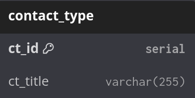
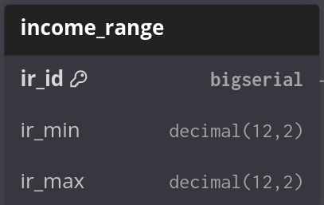
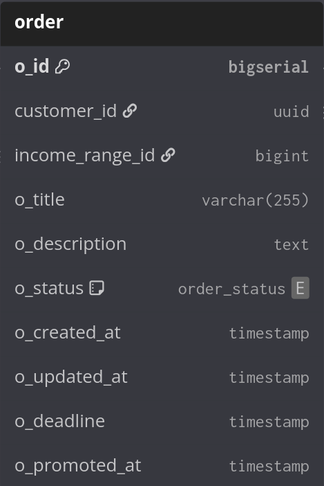
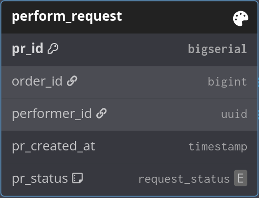

### Відношення member (користувач)

Функціональні залежності:
- m_id → m_login, m_email, m_phc, m_registration_dt  

Детермінанти відношення:
- m_id

Потенційні ключі:
- m_id

Кожен детермінант є потенційним ключем. Умова НФБК виконана.  

### Відношення contact_type (тип контакту)

Функціональні залежності:
- ct_id → ct_title  

Детермінанти відношення:
- ct_id

Потенційні ключі:
- ct_id

Кожен детермінант є потенційним ключем. Умова НФБК виконана.  

### Відношення contact (контакт)

Функціональні залежності:
- c_id → member_id, contact_type_id, c_value  

Детермінанти відношення:
- c_id

Потенційні ключі:
- c_id

Кожен детермінант є потенційним ключем. Умова НФБК виконана.  

### Відношення performer (виконавець)

Функціональні залежності:
- member_id → expected_income_id, p_experience, p_resume, p_promoted_at  

Детермінанти відношення:
- member_id

Потенційні ключі:
- member_id

Кожен детермінант є потенційним ключем. Умова НФБК виконана.  

### Відношення income_range (діапазон доходу)

Функціональні залежності:
- ir_id → ir_min, ir_max  

Детермінанти відношення:
- ir_id

Потенційні ключі:
- ir_id

Кожен детермінант є потенційним ключем. Умова НФБК виконана.  

### Відношення skill (навичка)

Функціональні залежності:
- s_id → s_title  

Детермінанти відношення:
- s_id

Потенційні ключі:
- s_id

Кожен детермінант є потенційним ключем. Умова НФБК виконана.  

### Відношення performer_skill (навичка виконавця)

Функціональні залежності:
- ps_id → performer_id, skill_id
- (performer_id, skill_id) → ps_id

Детермінанти відношення:
- ps_id
- (performer_id, skill_id)

Потенційні ключі:
- ps_id
- (performer_id, skill_id)

Кожен детермінант є потенційним ключем. Умова НФБК виконана.  

### Відношення customer (замовник)

Функціональні залежності:
- member_id → ∅ (немає додаткових атрибутів, крім ключа)

Детермінанти відношення:
- member_id

Потенційні ключі:
- member_id

Кожен детермінант є потенційним ключем. Умова НФБК виконана.  

### Відношення required_skill (необхідна навичка замовлення)

Функціональні залежності:
- rs_id → order_id, skill_id
- (order_id, skill_id) → rs_id

Детермінанти відношення:
- rs_id
- (order_id, skill_id)

Потенційні ключі:
- rs_id
- (order_id, skill_id)

Кожен детермінант є потенційним ключем. Умова НФБК виконана.  

### Відношення order (замовлення)

Функціональні залежності:
- o_id → customer_id, income_range_id, o_title, o_description, o_status, o_created_at, o_updated_at, o_deadline, o_promoted_at  

Детермінанти відношення:
- o_id

Потенційні ключі:
- o_id

Кожен детермінант є потенційним ключем. Умова НФБК виконана.  

### Відношення perform_request (запит на виконання)

Функціональні залежності:
- pr_id → order_id, performer_id, pr_created_at, pr_status  
- (order_id, performer_id) → pr_id, pr_created_at, pr_status  

Детермінанти відношення:
- pr_id
- (order_id, performer_id)

Потенційні ключі:
- pr_id
- (order_id, performer_id)

Кожен детермінант є потенційним ключем. Умова НФБК виконана.  

### Відношення comment (відгук/коментар)

Функціональні залежності:
- c_id → finished_order_id, c_from, c_to, c_content, c_created_at, c_type  

Детермінанти відношення:
- c_id

Потенційні ключі:
- c_id

Кожен детермінант є потенційним ключем. Умова НФБК виконана.  
